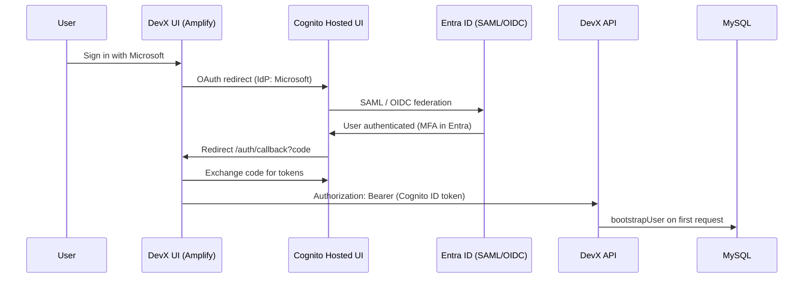

# Azure AD (Entra ID) & Cognito Authentication Setup — AWS Deployment

This guide is for **client IT / IAM teams** configuring sign-in for **DevX / Astra on AWS** (`DEVX_HOSTING=aws`).

## Summary for stakeholders

| Layer | Role |
|-------|------|
| **Microsoft Entra ID** | Corporate identity — SAML/OIDC sign-in, MFA, Conditional Access |
| **Amazon Cognito** | Completes OAuth flow; issues the **application token** DevX trusts |
| **DevX / Astra** | Accepts **Cognito ID tokens** only on AWS; creates users and roles in the app database |

Users only see **Sign in with Microsoft**. Entra is not replaced. Cognito does not bypass Entra SAML or MFA when federation is configured correctly.

> **Not used on AWS:** Direct MSAL / Entra SPA app registration with redirect URIs pointing at the DevX URL (`client/src/config/msalConfig.ts` applies only when `DEVX_HOSTING=azure`).

---

## Architecture



**If Cognito is removed:** Sign-in stops. There is no automatic fallback to Entra-only. Connecting DevX directly to Entra (MSAL) requires a different hosting mode and code/build changes (`DEVX_HOSTING=azure`).

---

## Part 1 — Microsoft Entra ID (Enterprise application SAML)

DevX on AWS does **not** use SAML directly to the DevX application URL. Configure Entra as a **federated identity provider to Amazon Cognito**.

### 1.1 Create the Enterprise application

**Entra ID → Enterprise applications → New application → Create your own application → Integrate any other application you don't find in the gallery (non-gallery) → SAML**

| Setting | Value |
|---------|--------|
| **Application name** | e.g. `Astra-DevX-Cognito` |
| **Identifier (Entity ID)** | From **AWS Cognito** → User pool → Federated identity provider (SAML) → **Service provider URN** (typically `urn:amazon:cognito:sp:<user-pool-id>`) |
| **Reply URL (Assertion Consumer Service URL)** | From Cognito SAML IdP → **ACS URL** (format: `https://<cognito-domain>.auth.<region>.amazoncognito.com/saml2/idpresponse`) |
| **Sign-on URL** | Optional when using Cognito Hosted UI |
| **Logout URL** | Optional; use Cognito SAML logout URL if single logout is required |

**Do not set Reply URL to:**

- `https://<devx-domain>/auth/callback`
- `https://<devx-domain>/`

Those URLs belong to the **Cognito OAuth app client**, not Entra SAML.

### 1.2 Certificates and metadata

| Item | Action |
|------|--------|
| **SAML signing certificate** | Use Entra default or organizational certificate |
| **Federation Metadata XML** | Download from Entra → upload in **Cognito → Identity provider → SAML** |

### 1.3 User assignment and security

| Setting | Recommendation |
|---------|----------------|
| **User assignment required** | Per organizational policy |
| **Users and groups** | Assign groups that should access DevX |
| **MFA / Conditional Access** | Configure on this app or via Entra policies — enforced during Microsoft sign-in |

### 1.4 SAML attributes and claims (required)

**Entra → Enterprise application → Single sign-on → Attributes & Claims**

| Claim | Suggested source | Required for DevX |
|-------|------------------|-------------------|
| **Unique User Identifier (Name ID)** | `user.objectid` or `user.userprincipalname` | Yes (federated subject) |
| **emailaddress** or **email** | `user.mail` or `user.userprincipalname` | **Yes** — API fails without email in token |
| **displayname** | `user.displayname` | Optional (display name) |

**Not required for DevX login:**

- Azure AD **app roles**
- **Group** claims for application RBAC (roles are managed inside DevX after first login)

### 1.5 What not to configure in Entra (AWS setup)

| Do not configure | Reason |
|------------------|--------|
| SPA / public client with redirect URI = DevX URL | Used only for `DEVX_HOSTING=azure` (MSAL), not AWS |
| SAML Reply URL = DevX `/auth/callback` | Wrong layer — OAuth callback is Cognito → browser |
| Separate Entra API permissions for DevX login | Application trusts **Cognito** JWTs, not Entra access tokens |

---

## Part 2 — Amazon Cognito (AWS)

Configured by the AWS / platform team. Values must match the **public DevX URL** and be embedded at **Docker build time** (`VITE_COGNITO_*`).

### 2.1 User pool

- Sign-in attribute: typically **email** (per deployment guide).
- Hosted UI domain: e.g. `devx-platform` → `devx-platform.auth.<region>.amazoncognito.com`.

### 2.2 Federated identity provider (Entra)

| Cognito field | Value |
|---------------|--------|
| **Provider type** | SAML 2.0 (or OIDC if your IdP team prefers OIDC) |
| **Provider name** | **`Microsoft`** — must match exactly; the app calls `signInWithRedirect({ provider: { custom: "Microsoft" } })` |
| **Metadata** | Entra Federation Metadata XML |

**Attribute mapping (Cognito → example SAML URIs):**

| User pool attribute | SAML attribute (adjust to your Entra claim URIs) |
|-------------------|--------------------------------------------------|
| `email` | `http://schemas.xmlsoap.org/ws/2005/05/identity/claims/emailaddress` |
| `name` | `http://schemas.xmlsoap.org/ws/2005/05/identity/claims/name` (optional) |

### 2.3 App client (OAuth / Hosted UI)

Replace `<devx-domain>` with your production URL (e.g. `https://astra.customer.com`).

**Allowed callback URLs** (all four are required by the application):

```
https://<devx-domain>/auth/callback
https://<devx-domain>/auth/callback/
https://<devx-domain>
https://<devx-domain>/
```

**Allowed sign-out URLs:**

```
https://<devx-domain>
https://<devx-domain>/
```

**Local development** (if applicable):

```
http://localhost:4000/auth/callback
http://localhost:4000/auth/callback/
http://localhost:4000
http://localhost:4000/
```

| OAuth setting | Value |
|---------------|--------|
| **Flow** | Authorization code |
| **Scopes** | `openid`, `email`, `profile`, `aws.cognito.signin.user.admin` |
| **Identity providers** | Cognito Hosted UI + federated **`Microsoft`** |

### 2.4 Record these values

| Variable | Used at |
|----------|---------|
| `COGNITO_USER_POOL_ID` | AWS Secrets Manager + `VITE_COGNITO_USER_POOL_ID` (build) |
| `COGNITO_APP_CLIENT_ID` | Secrets Manager + `VITE_COGNITO_APP_CLIENT_ID` (build) |
| `COGNITO_REGION` | Secrets Manager + `VITE_COGNITO_REGION` (build) |
| `COGNITO_DOMAIN` / `VITE_COGNITO_DOMAIN` | Hosted UI domain prefix or full domain (build) |

Server runtime: `DEVX_HOSTING=aws`, `AWS_SECRET_NAME`, Cognito keys loaded from Secrets Manager at startup.

---

## Part 3 — Application behavior (reference)

| Topic | Behavior |
|-------|----------|
| **Sign-in UI** | Landing page: **Sign in with Microsoft** only |
| **Token sent to API** | `Authorization: Bearer <cognito_id_token>` |
| **User bootstrap** | Automatic on first authenticated API request (not a separate MSAL bootstrap call) |
| **Provider in database** | `cognito` |
| **Default role** | Viewer on first login; admins assign roles in DevX |
| **Tenant key** | Cognito User Pool ID (from token) |

Relevant code:

- `client/src/config/amplify-config.ts` — OAuth redirect URLs and scopes
- `client/src/contexts/amplify-auth-context.tsx` — `Microsoft` IdP redirect
- `server/auth/jwt-validator.ts` — Cognito JWT validation
- `server/auth/middleware.ts` — User bootstrap from Bearer token

---

## Part 4 — Build and deployment checklist

### Client / AWS IT

- [ ] Cognito user pool and Hosted UI domain created
- [ ] SAML (or OIDC) IdP **`Microsoft`** linked to Entra
- [ ] Entra Enterprise app Identifier + Reply URL match Cognito SAML settings
- [ ] Entra attributes: **email** mapped and populated (`mail` or `UPN`)
- [ ] Cognito app client callback and sign-out URLs match **production DevX URL**
- [ ] Scope `aws.cognito.signin.user.admin` enabled on app client
- [ ] Users/groups assigned in Entra (if assignment required)
- [ ] MFA / Conditional Access applied in Entra as required

### Vendor / implementation

- [ ] Docker image built with `VITE_DEVX_HOSTING=aws` and correct `VITE_COGNITO_*`
- [ ] Deployment sets `DEVX_HOSTING=aws` and `AWS_SECRET_NAME`
- [ ] Secrets Manager includes `COGNITO_*` and `MYSQL_*`
- [ ] UAT: browser console shows Cognito/Amplify mode (not MSAL)
- [ ] UAT: `GET /api/auth/me` succeeds after sign-in
- [ ] UAT: new user row with `provider = cognito`

---

## Part 5 — Information to exchange before go-live

| # | Item | Owner |
|---|------|--------|
| 1 | Production **DevX URL** (HTTPS) | Client |
| 2 | Cognito **User Pool ID**, **region**, **Hosted UI domain** | AWS team |
| 3 | Cognito SAML **Identifier** and **ACS URL** for Entra | AWS team → Entra team |
| 4 | Entra **Federation Metadata XML** | Entra team → AWS team |
| 5 | Primary **email claim** (`mail` vs `userPrincipalName`) | Entra team |
| 6 | SAML vs OIDC preference | Client IAM |

---

## Troubleshooting

| Symptom | Likely cause | Action |
|---------|--------------|--------|
| `redirect_mismatch` | Callback URL not registered in Cognito | Add all four callback URL variants for exact hostname |
| IdP / provider not found | Wrong Cognito IdP name | Name federated provider **`Microsoft`** |
| Login works but API 401 | Build/runtime Cognito client ID mismatch | Align `VITE_COGNITO_APP_CLIENT_ID` with Secrets Manager `COGNITO_APP_CLIENT_ID` |
| Missing email error | SAML attribute mapping | Map `email` in Cognito; fix Entra claims |
| Users see MSAL / wrong mode | Wrong build flags | Rebuild with `VITE_DEVX_HOSTING=aws` |
| Entra SAML to DevX URL fails | Wrong architecture | Point SAML ACS to **Cognito**, not DevX |

---

## Related documentation

- [EKS Client Setup Guide](./EKS_CLIENT_SETUP_GUIDE.md) — Section 5.3 (Cognito), Phase 8 (build-time variables)
- [Deploy README](../../deploy/README.md) — Hosting modes (`DEVX_HOSTING=aws` vs `azure`)
- [Server auth README](../../server/auth/README.md) — User bootstrap and RBAC

---

## One-paragraph client email (copy/paste)

Users sign in with Microsoft through your existing Entra ID login (including SAML and MFA). Amazon Cognito does not replace Entra; it completes the login flow and gives DevX a secure application token after Entra has authenticated the user. Entra must be configured with SAML Reply URL and Identifier pointing to **Cognito** (from the Cognito console), not to the DevX website. DevX callback URLs (`/auth/callback`) are configured in **Cognito** only. DevX on AWS accepts Cognito tokens only. Removing Cognito would stop sign-in unless the product is changed to connect directly to Entra.
