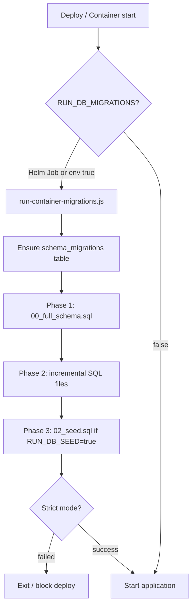

# DevX 2.0 — Client Database Migration Guide

**Document purpose:** End-to-end instructions for provisioning the DevX database automatically at deployment time (container / Kubernetes), including full production schema parity.

**Audience:** Client platform / DevOps / DBA teams  
**Version:** 1.0 (May 2026)  
**Validated against:** Aurora MySQL reference environment (173 tables)

---

## Table of contents

1. [Executive summary](#1-executive-summary)
2. [What is delivered](#2-what-is-delivered)
3. [How it works](#3-how-it-works)
4. [Prerequisites](#4-prerequisites)
5. [Scenario A — New empty database (greenfield)](#5-scenario-a--new-empty-database-greenfield)
6. [Scenario B — Database already has some tables (brownfield)](#6-scenario-b--database-already-has-some-tables-brownfield)
7. [Deployment options](#7-deployment-options)
8. [Step-by-step: EKS / Helm (recommended)](#8-step-by-step-eks--helm-recommended)
9. [Step-by-step: Container startup (entrypoint)](#9-step-by-step-container-startup-entrypoint)
10. [Step-by-step: Manual / CI (optional)](#10-step-by-step-manual--ci-optional)
11. [Verification checklist](#11-verification-checklist)
12. [Environment variables reference](#12-environment-variables-reference)
13. [What is seeded vs what is not](#13-what-is-seeded-vs-what-is-not)
14. [Upgrades and re-deployments](#14-upgrades-and-re-deployments)
15. [Troubleshooting](#15-troubleshooting)
16. [FAQ](#16-faq)
17. [Support contacts / handoff](#17-support-contacts--handoff)

---

## 1. Executive summary

DevX ships with **automated database provisioning** built into the application container image. On each deployment:

1. The platform connects to your MySQL / Aurora database using credentials from secrets.
2. It applies the **full application schema** (173 tables, matching the reference production environment).
3. It applies optional **reference seed data** (roles, subscription types, default personas).
4. It records progress in a `schema_migrations` table so **restarts and upgrades are safe** (already-applied steps are skipped).
5. The application starts only after migrations succeed (when strict mode is enabled).

**You do not need to run manual SQL scripts** (`01_schema.sql`, `02_seed.sql`, etc.) on greenfield installs—the image and Helm chart handle this.

---

## 2. What is delivered

| Deliverable | Description |
|-------------|-------------|
| **Full schema baseline** | `migrations/baseline/00_full_schema.sql` — all 173 tables (`CREATE TABLE IF NOT EXISTS`) |
| **Incremental patches** | `migrations/manual/*.sql` — column/index updates after baseline |
| **Reference seed** | `migrations/manual/02_seed.sql` — roles, subscription types, default personas |
| **Migration manifest** | `migrations/migration-order.json` — execution order |
| **Container entrypoint** | Runs migrations before app when `RUN_DB_MIGRATIONS=true` |
| **Helm migration Job** | One-shot Job before app pods (recommended for EKS) |
| **Coverage report** | `migrations/baseline/SCHEMA_COVERAGE.json` — confirms 173/173 tables |

**Supersedes:** Earlier handoff of `01_schema_new1.sql` + `02_seed.sql` alone (~95 tables). The new baseline provides **complete production parity**.

---

## 3. How it works



| Phase | Content | Behavior on existing DB |
|-------|---------|-------------------------|
| 1 — Baseline | All tables | `CREATE TABLE IF NOT EXISTS` — skips existing tables, creates missing ones |
| 2 — Incrementals | ALTER / patches | Idempotent where possible; duplicate column errors are skipped |
| 3 — Seed | Roles, plans, personas | `ON DUPLICATE KEY UPDATE` — no duplicate rows |

**Tracking:** Each file is logged in `schema_migrations`. A second deploy skips completed files.

---

## 4. Prerequisites

### 4.1 Database

| Requirement | Detail |
|-------------|--------|
| Engine | **MySQL 8.0+** or **Amazon Aurora MySQL** (compatible) |
| Charset | `utf8mb4` recommended |
| Database | **Empty** for first install, or **partially provisioned** (see Scenario B) |
| Connectivity | Application pods / containers must reach RDS on port **3306** (or your port) |
| SSL | Enabled for Aurora (`MYSQL_SSL=true` in Helm defaults) |

### 4.2 Credentials (required in secrets)

Store these in **AWS Secrets Manager** and/or **Kubernetes secret** (e.g. `devx-runtime-env`):

| Variable | Example | Description |
|----------|---------|-------------|
| `MYSQL_HOST` | `your-cluster.region.rds.amazonaws.com` | Aurora cluster endpoint |
| `MYSQL_PORT` | `3306` | MySQL port |
| `MYSQL_USER` | `devxadmin` | Database user with DDL + DML on target database |
| `MYSQL_PASSWORD` | *(secret)* | User password |
| `MYSQL_DATABASE` | `devx_prod` | Target database name |

### 4.3 Application image

- DevX backend Docker image built from the delivered repository (includes `migrations/` folder).
- Same image used for **migration Job** and **application Deployment**.

### 4.4 Permissions

The database user must be able to:

- `CREATE TABLE`, `ALTER TABLE`, `CREATE INDEX`
- `INSERT`, `UPDATE`, `SELECT`, `DELETE` (for seeds and app runtime)
- `CREATE DATABASE` only if your team creates the database separately (recommended: DBA creates empty DB, app user owns that schema)

---

## 5. Scenario A — New empty database (greenfield)

**Use when:** First DevX install in client environment.

### Steps (high level)

| Step | Owner | Action |
|------|-------|--------|
| 1 | Client DBA | Create empty database, e.g. `CREATE DATABASE devx_prod CHARACTER SET utf8mb4 COLLATE utf8mb4_0900_ai_ci;` |
| 2 | Client DevOps | Create K8s secret / Secrets Manager JSON with all `MYSQL_*` variables |
| 3 | Client DevOps | Configure network: EKS → RDS security groups |
| 4 | Client DevOps | Deploy DevX Helm chart (migration Job enabled by default) |
| 5 | System | Migration Job runs → 173 tables + seed data |
| 6 | System | Application pods start |
| 7 | Client | Verify tables + health endpoint (Section 11) |
| 8 | Client users | First login via SSO (Azure AD / Cognito) creates users and tenants |

**Expected duration:** First migration ~2–10 minutes depending on RDS size and network.

---

## 6. Scenario B — Database already has some tables (brownfield)

**Use when:** Client already ran earlier DevX SQL scripts (`01_schema`, partial manual scripts, etc.).

### What happens

- **Existing tables and data are preserved.**
- Migration adds **only missing tables** (`CREATE TABLE IF NOT EXISTS`).
- Seed data merges via `ON DUPLICATE KEY UPDATE`.
- No automatic `DROP DATABASE` or table truncation.

### Steps

| Step | Action |
|------|--------|
| 1 | **Do not drop** the database if it contains data you need |
| 2 | Ensure `MYSQL_*` points to the **existing** database |
| 3 | Deploy with migrations enabled (same as greenfield) |
| 4 | After deploy, verify table count approaches **173** (Section 11) |
| 5 | Run application smoke test (login, projects, SDLC) |

### When to involve DBA

- Table count stays far below 173 after migration
- Application errors mention missing columns (schema drift vs reference)
- `schema_migrations` shows `failed` for critical files

---

## 7. Deployment options

| Option | Best for | Description |
|--------|----------|-------------|
| **A — Helm migration Job** | **Production EKS (recommended)** | One Job per `helm upgrade`, runs **before** app pods. Avoids every replica running migrations. |
| **B — Container entrypoint** | Single replica, dev, client insistence on “container start” | Every pod runs migrations on start, then `npm start`. |
| **C — Manual CLI** | Pre-deploy validation, air-gapped | Run `npm run migrate:container` from a machine that can reach RDS. |

**Recommendation:** Use **Option A** for production; mention Option B only if client requires literal container-start behavior and accepts single-replica or idempotent multi-replica behavior.

---

## 8. Step-by-step: EKS / Helm (recommended)

### Step 1 — Create the database

Connect to Aurora as admin and run:

```sql
CREATE DATABASE devx_prod
  CHARACTER SET utf8mb4
  COLLATE utf8mb4_0900_ai_ci;
```

Grant privileges to the application user on `devx_prod.*`.

### Step 2 — Create Kubernetes secret

Namespace example: `devx`

```bash
kubectl create secret generic devx-runtime-env -n devx \
  --from-literal=MYSQL_HOST=your-cluster.region.rds.amazonaws.com \
  --from-literal=MYSQL_PORT=3306 \
  --from-literal=MYSQL_USER=devxadmin \
  --from-literal=MYSQL_PASSWORD='your-password' \
  --from-literal=MYSQL_DATABASE=devx_prod
```

Add all other application keys your environment requires (auth, AWS, Jira, etc.) per the main EKS setup guide.

### Step 3 — Confirm Helm migration settings

In `deploy/eks/helm/devx/values.yaml` (defaults):

```yaml
mysql:
  existingSecret: devx-runtime-env

migrations:
  runAsJob: true          # pre-install / pre-upgrade Job
  runOnPodStart: false    # do not migrate on every pod
  seed: "true"            # apply 02_seed.sql
  strict: "true"          # fail deploy if migration fails
  mysqlSsl: "true"
```

### Step 4 — Deploy application

```bash
helm upgrade --install devx deploy/eks/helm/devx \
  --namespace devx \
  --set image.repository=<your-ecr>/devx/backend \
  --set image.tag=<build-id>
```

### Step 5 — Watch migration Job

```bash
kubectl get jobs -n devx
kubectl logs -n devx job/devx-db-migrate-<revision>
```

**Success indicators:**

- Job status: `Complete`
- Logs contain: `[migrate] Done — ok=...`
- No fatal error before app rollout

### Step 6 — Verify application pods

```bash
kubectl get pods -n devx
kubectl logs -n devx deployment/devx --tail=50
```

Health check: `GET /healthz` or `/api/health` per your ingress configuration.

### Step 7 — Complete verification (Section 11)

---

## 9. Step-by-step: Container startup (entrypoint)

Use when the client requires migrations to run **inside the application container** on start.

### Step 1 — Disable Helm Job (avoid double migration)

```yaml
migrations:
  runAsJob: false
  runOnPodStart: true
```

### Step 2 — Set environment on Deployment

```yaml
env:
  - name: RUN_DB_MIGRATIONS
    value: "true"
  - name: RUN_DB_SEED
    value: "true"
  - name: RUN_DB_MIGRATIONS_STRICT
    value: "true"
  - name: DEVX_REPO_ROOT
    value: "/app"
```

`MYSQL_*` come from `envFrom.secretRef` (same secret as app).

### Step 3 — Replica count

For **first production deploy**, use `replicaCount: 1` until idempotent behavior is confirmed. For multi-replica, prefer Helm Job (Section 8).

### Step 4 — Deploy and check logs

```bash
kubectl logs -n devx deployment/devx --tail=100
```

Look for:

```text
[entrypoint] Running database migrations...
[migrate] DevX database migration (container startup)
[entrypoint] Database migrations finished.
```

### Step 5 — Verification (Section 11)

---

## 10. Step-by-step: Manual / CI (optional)

For validation before EKS deploy, from a machine with network access to RDS:

```bash
git clone <devx-repo>
cd DevX_2.0
npm ci

# Configure .env with MYSQL_* (never commit .env)

export RUN_DB_MIGRATIONS=true
export RUN_DB_SEED=true
npm run migrate:container
```

---

## 11. Verification checklist

Run against the target database after migration.

### 11.1 Table count

```sql
SELECT COUNT(*) AS table_count
FROM information_schema.tables
WHERE table_schema = DATABASE()
  AND table_type = 'BASE TABLE';
```

| Result | Status |
|--------|--------|
| **173** | Full parity |
| 90–172 | Partial — re-run migration or investigate failures |
| &lt; 90 | Migration likely failed or wrong database |

### 11.2 Migration history

```sql
SELECT migration_name, status, executed_at
FROM schema_migrations
ORDER BY executed_at DESC
LIMIT 25;
```

Expect `baseline/00_full_schema` with `status = success`.

### 11.3 Seed data

```sql
SELECT id, code, name FROM subscription_types ORDER BY code;
```

Expect **3 rows:**

| code | name |
|------|------|
| DEFAULT | Default Subscription |
| STANDARD | Standard Subscription |
| ENTERPRISE | Enterprise Subscription |

```sql
SELECT id, name FROM roles ORDER BY id;
```

Expect **8 roles** (TenantAdmin, OrgAdmin, ProjectAdmin, etc.).

```sql
SELECT COUNT(*) FROM personas WHERE is_default = 1;
```

Expect **5** default personas.

### 11.4 Application

| Check | Pass? |
|-------|-------|
| Health endpoint returns 200 | |
| User can log in (SSO) | |
| Settings page loads | |
| Can create / open a project | |
| SDLC module loads without DB errors | |

### 11.5 Re-deploy test (idempotency)

Run `helm upgrade` again (or restart pod with migrations enabled). Migration should **skip** completed steps and complete quickly.

---

## 12. Environment variables reference

| Variable | Required | Default | Description |
|----------|----------|---------|-------------|
| `MYSQL_HOST` | Yes | — | RDS / Aurora endpoint |
| `MYSQL_PORT` | No | `3306` | Port |
| `MYSQL_USER` | Yes | — | DB user |
| `MYSQL_PASSWORD` | Yes | — | DB password |
| `MYSQL_DATABASE` | Yes | — | Database name |
| `MYSQL_SSL` | No | `true` (Helm) | Set `false` only for local dev without SSL |
| `RUN_DB_MIGRATIONS` | For auto migrate | unset | `true` or `1` to enable |
| `RUN_DB_SEED` | No | unset | `true` to apply `02_seed.sql` |
| `RUN_DB_MIGRATIONS_STRICT` | No | unset | `true` = exit on migration failure |
| `DEVX_REPO_ROOT` | In container | `/app` | Path to migrations in image |

---

## 13. What is seeded vs what is not

### Seeded automatically (`02_seed.sql`)

- Subscription types (DEFAULT, STANDARD, ENTERPRISE)
- RBAC roles (TenantAdmin, OrgAdmin, Developer, etc.)
- Default personas (for BRD / workflow demos)
- Sample golden repository references (optional placeholders)

### Not seeded (created at runtime)

- Tenants and organizations
- Users (created on **first SSO login**)
- User–role assignments (admin UI or bootstrap)
- License keys (client-specific generation process)
- Projects, ADO/Jira connections, workflow data

---

## 14. Upgrades and re-deployments

| Event | Behavior |
|-------|----------|
| New app version, same DB | Only **new** migration files run; rest skipped |
| Pod restart | Skips completed migrations |
| New migration file added in release | Applied once, recorded in `schema_migrations` |
| Failed migration in strict mode | Deploy blocked until fixed |

Future schema changes are delivered as new SQL files in `migrations/manual/` and updated `migration-order.json` in subsequent releases.

---

## 15. Troubleshooting

| Symptom | Likely cause | Action |
|---------|--------------|--------|
| Cannot connect to MySQL | SG / network / wrong host | Verify EKS → RDS; test from debug pod |
| Migration Job `Failed` | Credentials, SSL, timeout | Check Job logs; verify `MYSQL_*` in secret |
| Table count &lt; 173 | Partial prior scripts; failed baseline | Check `schema_migrations`; re-run after fix |
| Only 1 `subscription_types` row | Old seed without UUID `id` | Delete bad rows; re-run seed (contact DevX support) |
| App `ER_NO_SUCH_TABLE` | Migration did not complete | Fix migration; verify table exists |
| App starts, migration never runs | `RUN_DB_MIGRATIONS` not set and Job disabled | Enable Job or entrypoint env |
| Slow first deploy | Large baseline SQL | Normal; wait for Job completion |
| Second deploy slow | Strict + re-running failed incrementals | Check failed entries in `schema_migrations` |

### Useful commands (EKS)

```bash
# Migration job logs
kubectl logs -n devx job/$(kubectl get jobs -n devx -o name | grep db-migrate | head -1 | cut -d/ -f2)

# App logs
kubectl logs -n devx deployment/devx --tail=100

# Secret keys (not values)
kubectl get secret devx-runtime-env -n devx -o jsonpath='{.data}' | jq 'keys'
```

---

## 16. FAQ

**Q: Do we still need to run `01_schema_new1.sql` and `02_seed.sql` manually?**  
A: **No** for new installs. The container/Helm pipeline runs the full baseline and seed automatically.

**Q: We already created some tables manually. Will deploy break?**  
A: **No.** Existing tables are kept. Missing tables are added. Verify count → 173 after deploy.

**Q: Is data migrated from another environment?**  
A: **No.** This is **schema + reference seed** only. Business data migration is a separate exercise.

**Q: How many tables should we see?**  
A: **173** tables in the reference production schema.

**Q: Container start vs Helm Job?**  
A: Both run the same migration code. **Helm Job** is recommended for production (runs once per release). **Container start** runs on every pod start when enabled.

**Q: What if migration fails?**  
A: With `strict: true`, the Job fails and app rollout should not proceed. Fix the error, redeploy.

**Q: Who creates users and tenants?**  
A: Users via **SSO first login**. Tenants/orgs via application onboarding or admin configuration.

---

## 17. Support contacts / handoff

| Item | Location |
|------|----------|
| Technical setup (EKS, secrets, IRSA) | `docs/deployment/EKS_CLIENT_SETUP_GUIDE.md` |
| Short migration reference | `migrations/CLIENT_DATABASE_SETUP.md` |
| Schema coverage proof | `migrations/baseline/SCHEMA_COVERAGE.json` |
| Expected table list | `docs/database/EXPECTED_PROD_TABLES.json` |
| Helm chart | `deploy/eks/helm/devx/` |

**Handoff checklist for DevX team:**

- [ ] Client received this guide
- [ ] Client Aurora endpoint and database name confirmed
- [ ] K8s secret `devx-runtime-env` populated with `MYSQL_*`
- [ ] Greenfield or brownfield scenario agreed
- [ ] Migration option chosen (Helm Job vs container start)
- [ ] Post-deploy verification (173 tables, roles, health) completed
- [ ] SSO login tested on client environment

---

## Appendix — Migration file order

Defined in `migrations/migration-order.json`:

1. `baseline/00_full_schema.sql` — all tables  
2. `manual/*.sql` — incremental patches (38 files)  
3. `manual/02_seed.sql` — reference data (when `RUN_DB_SEED=true`)

---

## Appendix — Reference architecture (AWS)

```text
┌─────────────────┐     ┌──────────────────┐     ┌─────────────────────┐
│  Azure Pipeline │────▶│  ECR Image       │────▶│  EKS Cluster        │
│  (build/push)   │     │  (app+migrations)│     │                     │
└─────────────────┘     └──────────────────┘     │  ┌───────────────┐  │
                                                  │  │ Migration Job │  │
                                                  │  │ (pre-upgrade) │  │
                                                  │  └───────┬───────┘  │
                                                  │          │          │
                                                  │  ┌───────▼───────┐  │
                                                  │  │ DevX Pods     │  │
                                                  │  └───────┬───────┘  │
                                                  └──────────┼──────────┘
                                                             │
                                                  ┌──────────▼──────────┐
                                                  │  Aurora MySQL       │
                                                  │  (devx_prod DB)     │
                                                  └─────────────────────┘
```

---

*End of document*
