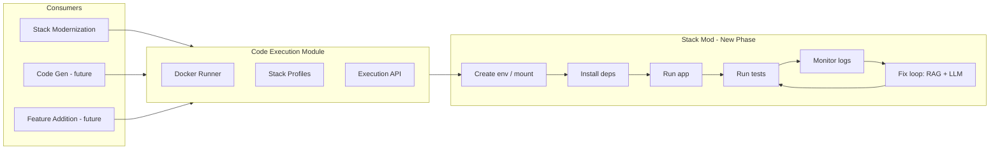

# Code Execution Module & Run–Fix–Validate Loop

## Goal

1. **Run generated code in an isolated environment** using Docker (so it works locally now and in containers later).
2. **After code + unit tests are generated**: create environment → install deps → run app → run tests.
3. **Monitor logs/terminal**; on failures/exceptions, **capture errors** and **fix via agents + LLM + RAG** (official docs), then re-run in a loop until tests pass or max iterations.
4. **Reusable execution module**: pluggable for Stack Modernization, future Code Gen, Feature Addition, etc.

Focus stacks: **.NET** and **Python** first.

---

## 1. High-Level Architecture



---

## 2. Code Execution Module (Pluggable)

**Location**: `server/code-execution/` (new top-level module beside `stack-modernization/`).

**Responsibility**: Run a project in a stack-specific Docker environment: mount repo, run arbitrary commands, stream stdout/stderr, return exit code and full logs. No business logic (no “fix”, no RAG)—only execution and log capture.

### 2.1 Public API (for any feature to use)

```ts
// server/code-execution/types.ts
export type StackType = "dotnet" | "python";  // extend later: node, go, etc.

export interface ExecutionRequest {
  /** Unique run id for this execution */
  runId: string;
  /** Stack (determines Docker image and commands) */
  stack: StackType;
  /** Absolute path to project root on host (will be mounted into container) */
  projectPath: string;
  /** Optional: override runtime version e.g. "8.0", "3.11" */
  runtimeVersion?: string;
}

export interface RunCommandOptions {
  /** Command to run inside container (e.g. "dotnet restore", "dotnet test") */
  command: string;
  /** Working directory relative to mounted project root */
  cwd?: string;
  timeoutMs?: number;
  /** If true, stream chunks; otherwise buffer and return at end */
  stream?: boolean;
}

export interface RunCommandResult {
  exitCode: number;
  stdout: string;
  stderr: string;
  timedOut: boolean;
  durationMs: number;
}

export interface ICodeExecutionService {
  /** Ensure the stack image exists (build or pull). */
  ensureImage(stack: StackType, runtimeVersion?: string): Promise<void>;
  /** Run a single command in a container with project mounted. */
  runCommand(request: ExecutionRequest, options: RunCommandOptions): Promise<RunCommandResult>;
  /** Optional: stream output for long-running commands (e.g. tests). */
  runCommandStream?(request: ExecutionRequest, options: RunCommandOptions): AsyncIterable<{ stdout?: string; stderr?: string; done?: RunCommandResult }>;
}
```

### 2.2 Stack Profiles (Docker + commands)

**Location**: `server/code-execution/profiles/`.

Each stack has a profile that defines:

- **Docker image** (official or custom): e.g. `mcr.microsoft.com/dotnet/sdk:8.0`, `python:3.11`.
- **Mount**: project path on host → `/workspace` (or similar) in container.
- **Install deps**: e.g. `dotnet restore`, `pip install -r requirements.txt`.
- **Run app**: e.g. `dotnet run`, `python main.py`.
- **Run tests**: e.g. `dotnet test`, `pytest`, `python -m pytest`.

Example profile shape:

```ts
// server/code-execution/profiles/types.ts
export interface StackProfile {
  stack: StackType;
  image: string;                    // e.g. "mcr.microsoft.com/dotnet/sdk:8.0"
  installCommand: string;           // "dotnet restore" or "pip install -r requirements.txt"
  runCommand: string;               // "dotnet run" / "python main.py"
  testCommand: string;             // "dotnet test" / "pytest"
  projectFile?: string;             // optional: entry csproj or main.py
}
```

- **dotnet**: Use `mcr.microsoft.com/dotnet/sdk:8.0` (or 9.0); `installCommand`: `dotnet restore`; `runCommand`: `dotnet run --project <sln/csproj>` or detect; `testCommand`: `dotnet test`.
- **python**: Use `python:3.11` or `python:3.12`; `installCommand`: `pip install -r requirements.txt` (or `pip install .`); `runCommand`: detect entry (e.g. `main.py` or module); `testCommand`: `pytest` or `python -m pytest`.

Docker images should be **defined in code** (Dockerfile in repo or image name) so they can be built/pulled by the module and later moved to any container runtime.

### 2.3 Docker Runner Implementation

**Location**: `server/code-execution/docker-runner.ts` (or `runners/docker.ts`).

- Use **Dockerode** (or `child_process` + `docker` CLI) to:
  - `docker create` (with volume mount: `projectPath` → `/workspace`), then `docker start` and `docker exec` for commands; **or**
  - `docker run --rm -v projectPath:/workspace image command` for one-off commands.
- Capture stdout/stderr (and exit code) for every run; support optional streaming.
- Timeout and kill container on timeout.
- No parsing of errors here—only raw logs and exit code.

### 2.4 Where the module is used

- **Stack Modernization**: after test generation, call this module to run restore → run → test, then pass logs into the “validation/fix” loop.
- **Future**: Code Gen, Feature Addition, or any feature that needs “run this repo in a sandbox” will import `server/code-execution` and call `runCommand` / `runCommandStream` only. No duplication of Docker or command logic.

---

## 3. Where This Fits in Stack Modernization

**Current flow**:  
assessment → wait_selections → validate → planning → wait_approval → task_planning → **code_upgrade** → **test_generation** → END.

**New phase**: Add a **run_and_validate** node after **test_generation** (or an optional “validation” phase that can be toggled).

- **Option A (recommended)**: New node **run_and_validate** after test_generation.  
  - test_generation → **run_and_validate** → END.  
  - run_and_validate: uses code-execution module + fix loop (see below).

- **Option B**: Optional sub-step inside test_generation: “generate tests” then “run and fix” in the same node.  
  - Keeps graph smaller but mixes “generate” and “run/fix” concerns.

Recommendation: **Option A** so that “run environment + fix loop” is a first-class step and progress/state (e.g. “Running tests”, “Fixing failures (attempt 2)”) is clear.

**State additions** (e.g. in `StackModernizationState` or a dedicated validation state):

- `validationRun?: { runId, status, lastLogs, exitCode, testSummary }`
- `validationAttempts?: number`
- `validationFixedFiles?: Array<{ path, patchOrContent }>` (for audit)
- `validationPassed?: boolean`

---

## 4. Run → Install → Run App → Run Tests (Sequence)

Inside **run_and_validate** (or the service it calls):

1. **Resolve project path**: Use the same artifact as “download upgrade” (e.g. temp dir with extracted files + modified files + generated tests written to disk). So: write `state.modifiedFiles` and `state.generatedTests` to a directory; that directory = `projectPath` for the execution module.
2. **Ensure image**: `codeExecution.ensureImage(stack, runtimeVersion)`.
3. **Install deps**: `codeExecution.runCommand({ runId, stack, projectPath }, { command: profile.installCommand })`. If exitCode !== 0, treat as failure and feed logs to fix loop.
4. **Run app** (optional but useful for startup errors): `codeExecution.runCommand(..., { command: profile.runCommand })`. If we only care about tests, this can be skipped or made configurable.
5. **Run tests**: `codeExecution.runCommand(..., { command: profile.testCommand, timeoutMs: 300000 })`. Capture stdout, stderr, exit code.
6. **Interpret result**: If exitCode === 0 and no failure patterns in logs → success, set `validationPassed = true`, persist state, end. Otherwise → feed logs to the fix loop.

All of the above use only the **code-execution module**; no fix logic here.

---

## 5. Monitor Logs & Fix Loop (Agent + RAG + Re-run)

**Goal**: Like Copilot/Claude/Cursor—observe failures, propose fixes using docs and LLM, apply and re-run until tests pass or max attempts.

### 5.1 Log / failure capture

- **Input**: Full stdout + stderr from the last `runCommand` (install, run, or test).
- **Parse**:
  - .NET: build errors (file, line, message), test failure lines (test name, assertion, stack trace).
  - Python: traceback, pytest failure lines (test name, assertion).
- **Structured output**: List of “issues” (type: build | test_failure | runtime; file?, line?, message, snippet).

No need for a separate “monitoring process”—we run one command, get logs, parse once per run. “Monitor” = run → get logs → analyze.

### 5.2 Fix agent (LLM + RAG)

- **Input**: List of issues + relevant file contents (from state.modifiedFiles / generatedTests) + optional repo context.
- **RAG**: Query a **documentation index** (official .NET and Python docs). Return top-k chunks (e.g. migration guides, API docs, error explanations).
- **LLM**: Prompt = “Here are the build/test failures and the relevant code. Here are relevant doc snippets. Propose minimal fixes (edits or patches).” Output: structured edits (file path, old range or content, new content) or full file content for changed files.
- **Apply**: Apply edits to the in-memory/file representation of the project (same as code upgrade: write back to `modifiedFiles` or temp dir), then **re-run** from “Install deps” (or just “Run tests” if only code changed). Increment attempt counter; if attempts >= max (e.g. 5), stop and mark validation as failed with last logs.

### 5.3 RAG for official documentation

- **Content**: For .NET and Python, ingest official docs (e.g. learn.microsoft.com for .NET, docs.python.org for Python). Options: (1) Pre-downloaded markdown/HTML, (2) Public docs API if any, (3) Snapshot stored in repo or object storage.
- **Index**: Use an in-process vector store (e.g. in-memory or file-based) with embeddings (OpenAI/other). Index by section + content; on error, query with “error message + stack trace snippet” to get relevant migration/API/error docs.
- **Location**: `server/code-execution/rag/` or `server/rag/` if shared across features. Stack Modernization only needs .NET and Python for now.
- **Usage**: Before calling the fix agent, run RAG with the current errors; pass retrieved chunks into the fix-agent prompt.

### 5.4 Loop summary

1. Run tests (via code-execution module).
2. If success → set `validationPassed = true`, persist, exit.
3. Parse logs → list of issues.
4. RAG: fetch doc chunks for these issues.
5. Fix agent: produce edits from issues + code + doc chunks.
6. Apply edits to project (write files).
7. Increment attempt; if attempt > max → persist “validation failed” + last logs, exit.
8. Go to step 1 (re-run tests; optionally re-run install if manifest changed).

---

## 6. Implementation Order

| Phase | What | Where |
|-------|------|--------|
| 1 | **Code execution module** (types, stack profiles, Docker runner) | `server/code-execution/` |
| 2 | **Docker images** for .NET and Python (Dockerfile or image names + ensure pull/build) | `server/code-execution/profiles/`, optional `server/code-execution/docker/` |
| 3 | **Write upgraded + tests to temp dir** (shared with download logic) so we have a `projectPath` | `server/stack-modernization/services/` or code-execution helper |
| 4 | **Run-and-validate node** (orchestration: install → run → test, capture logs) | `server/stack-modernization/graph/nodes.ts` + new agent or service |
| 5 | **Log parser** (.NET + Python build/test failure parsing) | `server/code-execution/parsers/` or `server/stack-modernization/services/validation/` |
| 6 | **RAG pipeline** (ingest .NET + Python docs, index, query) | `server/code-execution/rag/` or `server/rag/` |
| 7 | **Fix agent** (prompt + apply edits, optionally with RAG chunks) | `server/stack-modernization/agents/fix-validation-agent.ts` or under `server/code-execution/agents/` |
| 8 | **Wire loop** in run_and_validate: run → parse → fix → re-run | Same node or validation service |
| 9 | **LangGraph**: add node, edge test_generation → run_and_validate → END | `server/stack-modernization/graph/index.ts` |
| 10 | **Config/feature flag** so “run and validate” can be turned off (e.g. no Docker on host) | Config or env |

---

## 7. File / Folder Layout (Suggested)

```
server/
  code-execution/                    # Pluggable module
    index.ts                         # Public API: createRunner(), ensureImage(), runCommand()
    types.ts                         # ExecutionRequest, RunCommandResult, StackType
    docker-runner.ts                 # Dockerode-based run with mount
    profiles/
      dotnet.ts                      # .NET SDK image, restore/run/test commands
      python.ts                      # Python image, pip/run/pytest commands
      index.ts                       # getProfile(stack, version?)
    parsers/                         # Optional: or under stack-modernization
      dotnet-errors.ts               # Parse build + test output
      python-errors.ts               # Parse traceback + pytest output
    rag/                              # Optional: or server/rag
      ingest-docs.ts                 # Ingest .NET / Python docs
      query.ts                       # Query by error text, return chunks
  stack-modernization/
    graph/
      nodes.ts                       # Add runAndValidateNode()
      index.ts                       # Add node + edge test_generation → run_and_validate → END
    agents/
      fix-validation-agent.ts        # LLM + RAG → edits
    services/
      validation-loop.ts             # Orchestrate: run → parse → fix → re-run
      prepare-project-dir.ts         # Write modifiedFiles + generatedTests to temp dir for execution
```

---

## 8. Dependency: Docker

- **Local**: Docker daemon must be running; images are pulled or built by the module.
- **Later (containers)**: Same Docker images and `projectPath` mount can be used from a container that runs the server (e.g. mount host path or a volume with the project). No change to the execution API—only where `projectPath` lives and how the Docker socket is exposed.

---

## 9. Summary

| Item | Approach |
|------|----------|
| **Environment** | Docker containers per stack (.NET, Python); images defined in code, mount project dir. |
| **Where in Stack Mod** | New node **run_and_validate** after test_generation; optional via config. |
| **Execution** | Separate **code-execution** module: ensure image, runCommand (install/run/test), return logs + exit code. |
| **Reuse** | Any feature (Stack Mod, Code Gen, Feature Addition) imports code-execution and calls runCommand; no duplication. |
| **Fix loop** | After each run: parse logs → RAG (official docs) → Fix agent (LLM) → apply edits → re-run until tests pass or max attempts. |
| **Stacks** | Start with .NET and Python only; stack profiles and parsers are extensible. |

This plan keeps execution isolated and reusable, and adds a clear “run → analyze logs → fix with RAG + LLM → re-run” loop inside Stack Modernization without tying the execution module to it.
